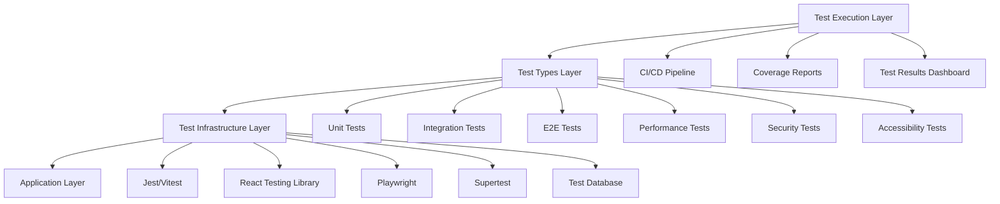

# Design Document

## Overview

This design document outlines the comprehensive testing strategy for the PlacementConnect placement management system. The testing framework will implement multiple layers of testing including unit tests, integration tests, end-to-end tests, performance tests, security tests, and accessibility tests. The design focuses on creating a robust, automated testing pipeline that ensures code quality, functionality, and user experience across all system components.

## Architecture

### Testing Framework Stack



### Testing Layers

1. **Unit Testing Layer**: Tests individual components, functions, and modules in isolation
2. **Integration Testing Layer**: Tests interactions between different system components
3. **End-to-End Testing Layer**: Tests complete user workflows and system behavior
4. **Performance Testing Layer**: Tests system performance under various load conditions
5. **Security Testing Layer**: Tests authentication, authorization, and data protection
6. **Accessibility Testing Layer**: Tests UI compliance with accessibility standards

## Components and Interfaces

### Test Configuration Management

```typescript
interface TestConfig {
  environment: 'test' | 'development' | 'ci';
  database: DatabaseConfig;
  coverage: CoverageConfig;
  timeouts: TimeoutConfig;
  reporters: ReporterConfig[];
}

interface DatabaseConfig {
  url: string;
  resetBetweenTests: boolean;
  seedData: boolean;
}

interface CoverageConfig {
  threshold: {
    statements: number;
    branches: number;
    functions: number;
    lines: number;
  };
  exclude: string[];
}
```

### Test Utilities and Helpers

```typescript
interface TestHelpers {
  setupTestDatabase(): Promise<void>;
  cleanupTestDatabase(): Promise<void>;
  createTestUser(role: UserRole): Promise<User>;
  createTestJob(): Promise<Job>;
  mockAuthSession(user: User): void;
  waitForElement(selector: string): Promise<Element>;
}

interface MockServices {
  authService: MockAuthService;
  emailService: MockEmailService;
  fileUploadService: MockFileUploadService;
}
```

### Test Data Management

```typescript
interface TestDataFactory {
  createStudent(overrides?: Partial<Student>): Student;
  createRecruiter(overrides?: Partial<Recruiter>): Recruiter;
  createTPOAdmin(overrides?: Partial<TPOAdmin>): TPOAdmin;
  createJob(overrides?: Partial<Job>): Job;
  createApplication(overrides?: Partial<Application>): Application;
}

interface TestFixtures {
  users: TestUserFixtures;
  jobs: TestJobFixtures;
  applications: TestApplicationFixtures;
}
```

## Data Models

### Test Result Models

```typescript
interface TestResult {
  id: string;
  testSuite: string;
  testName: string;
  status: 'pass' | 'fail' | 'skip';
  duration: number;
  error?: TestError;
  coverage?: CoverageData;
}

interface TestSuite {
  name: string;
  type: TestType;
  tests: TestResult[];
  totalDuration: number;
  passRate: number;
}

interface CoverageData {
  statements: CoverageMetric;
  branches: CoverageMetric;
  functions: CoverageMetric;
  lines: CoverageMetric;
}

interface CoverageMetric {
  total: number;
  covered: number;
  percentage: number;
}
```

### Performance Test Models

```typescript
interface PerformanceTestResult {
  testName: string;
  metrics: PerformanceMetrics;
  thresholds: PerformanceThresholds;
  status: 'pass' | 'fail';
}

interface PerformanceMetrics {
  responseTime: {
    min: number;
    max: number;
    avg: number;
    p95: number;
    p99: number;
  };
  throughput: number;
  errorRate: number;
  memoryUsage: number;
}
```

## Error Handling

### Test Error Management

```typescript
interface TestErrorHandler {
  handleTestFailure(error: TestError): void;
  generateErrorReport(errors: TestError[]): ErrorReport;
  notifyOnCriticalFailure(error: CriticalTestError): void;
}

interface TestError {
  testName: string;
  errorType: 'assertion' | 'timeout' | 'setup' | 'teardown';
  message: string;
  stack: string;
  screenshot?: string;
}

interface ErrorReport {
  summary: ErrorSummary;
  details: TestError[];
  recommendations: string[];
}
```

### Test Environment Error Handling

- **Database Connection Failures**: Retry logic with exponential backoff
- **Test Timeout Handling**: Configurable timeouts with cleanup procedures
- **Resource Cleanup**: Automatic cleanup of test data and resources
- **CI/CD Pipeline Failures**: Detailed error reporting and notification system

## Testing Strategy

### Unit Testing Strategy

**Framework**: Jest/Vitest with React Testing Library
**Coverage Target**: 90% code coverage
**Test Structure**:
- Component rendering tests
- Function behavior tests
- Edge case and error condition tests
- Mock external dependencies

**Example Test Structure**:
```typescript
describe('JobCard Component', () => {
  it('should render job information correctly', () => {
    // Test implementation
  });
  
  it('should handle apply button click', () => {
    // Test implementation
  });
  
  it('should display error state when job data is invalid', () => {
    // Test implementation
  });
});
```

### Integration Testing Strategy

**Framework**: Supertest with test database
**Focus Areas**:
- API endpoint testing
- Database integration testing
- Authentication flow testing
- Service layer integration

**Test Database Strategy**:
- Isolated test database instance
- Automatic reset between test suites
- Seed data for consistent testing
- Transaction rollback for cleanup

### End-to-End Testing Strategy

**Framework**: Playwright
**Browser Coverage**: Chrome, Firefox, Safari
**Test Scenarios**:
- Complete user registration and login flows
- Job posting and application workflows
- Admin approval and management processes
- Cross-browser compatibility testing

**Page Object Model**:
```typescript
class LoginPage {
  constructor(private page: Page) {}
  
  async login(email: string, password: string): Promise<void> {
    // Implementation
  }
  
  async expectLoginSuccess(): Promise<void> {
    // Implementation
  }
}
```

### Performance Testing Strategy

**Tools**: Artillery.js for load testing, Lighthouse for web performance
**Metrics**:
- Response time under load
- Database query performance
- Memory usage patterns
- Concurrent user handling

**Load Testing Scenarios**:
- Normal load: 100 concurrent users
- Peak load: 500 concurrent users
- Stress test: 1000+ concurrent users

### Security Testing Strategy

**Focus Areas**:
- Authentication bypass attempts
- Authorization boundary testing
- Input validation and sanitization
- Session management security
- SQL injection prevention
- XSS protection

**Security Test Categories**:
- Authentication security tests
- Authorization boundary tests
- Input validation tests
- Session security tests

### Accessibility Testing Strategy

**Tools**: axe-core, Lighthouse accessibility audit
**Standards**: WCAG 2.1 AA compliance
**Test Areas**:
- Keyboard navigation
- Screen reader compatibility
- Color contrast ratios
- ARIA attributes
- Form accessibility

## Test Execution Pipeline

### Continuous Integration Flow

```mermaid
graph LR
    A[Code Commit] --> B[Lint & Format Check]
    B --> C[Unit Tests]
    C --> D[Integration Tests]
    D --> E[Build Application]
    E --> F[E2E Tests]
    F --> G[Performance Tests]
    G --> H[Security Tests]
    H --> I[Accessibility Tests]
    I --> J[Coverage Report]
    J --> K[Deploy/Merge]
```



### Test Execution Stages

1. **Pre-commit**: Lint, format, and quick unit tests
2. **Commit**: Full unit test suite execution
3. **Pull Request**: Integration and E2E tests
4. **Pre-deployment**: Performance and security tests
5. **Post-deployment**: Smoke tests and monitoring

### Reporting and Monitoring

**Test Reports**:
- Coverage reports with detailed metrics
- Performance benchmarks and trends
- Security vulnerability reports
- Accessibility compliance reports

**Monitoring**:
- Test execution time trends
- Flaky test identification
- Coverage trend analysis
- Performance regression detection

## Test Data Management

### Test Data Strategy

**Data Categories**:
- Static test fixtures for consistent scenarios
- Dynamic test data generation for varied testing
- Anonymized production data for realistic testing
- Edge case data for boundary testing

**Data Lifecycle**:
- Setup: Create test data before test execution
- Isolation: Ensure tests don't interfere with each other
- Cleanup: Remove test data after execution
- Reset: Return database to known state

### Mock and Stub Strategy

**External Service Mocking**:
- Email service mocking for notification testing
- File upload service mocking for document handling
- Third-party API mocking for integration testing

**Database Mocking**:
- In-memory database for unit tests
- Test database instance for integration tests
- Transaction-based isolation for parallel testing