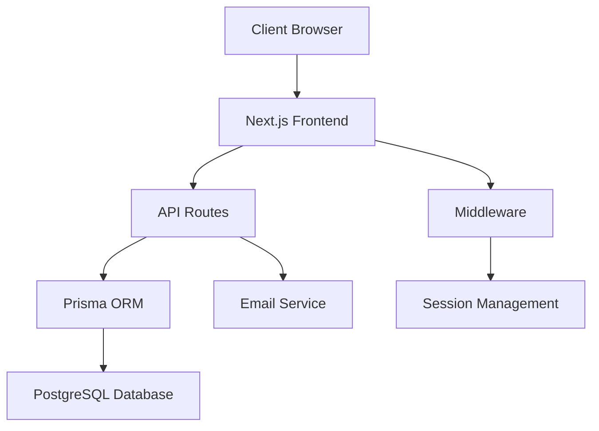

# Design Document

## Overview

The placement management system is built on a Next.js 15 application with Prisma ORM and PostgreSQL database. The system implements role-based access control for three user types: Students, Company Recruiters, and TPO Administrators. The architecture follows a server-side rendering approach with API routes for backend functionality, secure session management, and automated email notifications.

## Architecture

### High-Level Architecture



### Technology Stack

- **Frontend**: Next.js 15 with React 19, Tailwind CSS
- **Backend**: Next.js API Routes
- **Database**: PostgreSQL with Prisma ORM
- **Authentication**: Custom session-based auth with bcryptjs
- **Email**: EmailJS for client-side email notifications
- **Testing**: Vitest with React Testing Library

### Folder Structure Enhancement

```
app/
├── (dashboards)/
│   ├── student/
│   ├── recruiter/
│   └── tpo/
├── api/
│   ├── auth/
│   ├── jobs/
│   ├── applications/
│   ├── users/
│   └── notifications/
├── auth/
│   ├── login/
│   ├── register/
│   └── approval/
└── components/
    ├── forms/
    ├── dashboards/
    └── notifications/
```

## Components and Interfaces

### Core Components

#### 1. Authentication System
- **RegistrationForm**: Multi-step form with role-specific fields
- **LoginForm**: Unified login for all user types
- **ApprovalQueue**: TPO interface for user approval
- **SessionProvider**: Context for user session management

#### 2. Job Management
- **JobPostingForm**: Recruiter job creation/editing
- **JobListings**: Student job browsing with search/filter
- **JobApprovalQueue**: TPO job posting approval interface
- **JobDetails**: Detailed job view with application functionality

#### 3. Application System
- **ApplicationForm**: Student job application submission
- **ApplicationTracker**: Student application status dashboard
- **ApplicationManager**: Recruiter application review interface
- **StatusUpdater**: Interface for updating application status

#### 4. Administrative Dashboard
- **TPODashboard**: Main administrative interface
- **UserManagement**: User account management
- **ReportGenerator**: Placement statistics and reports
- **SystemStats**: Real-time system metrics

#### 5. Notification System
- **NotificationCenter**: In-app notification display
- **EmailTemplates**: Reusable email templates
- **NotificationSettings**: User notification preferences

### API Interfaces

#### Authentication APIs
```javascript
// POST /api/auth/register
{
  role: 'STUDENT' | 'RECRUITER' | 'TPO',
  name: string,
  email: string,
  password: string,
  roleSpecificData: object
}

// POST /api/auth/login
{
  email: string,
  password: string
}

// POST /api/auth/approve
{
  userId: string,
  approved: boolean,
  reason?: string
}
```

#### Job Management APIs
```javascript
// POST /api/jobs
{
  jobDescription: string,
  eligibilityCriteria: string,
  applicationDeadline: Date
}

// GET /api/jobs?status=approved&search=term
// PUT /api/jobs/:id/approve
// DELETE /api/jobs/:id
```

#### Application APIs
```javascript
// POST /api/applications
{
  jobId: string,
  studentId: string
}

// PUT /api/applications/:id/status
{
  status: 'APPLIED' | 'SHORTLISTED' | 'INTERVIEW_SCHEDULED' | 'HIRED' | 'REJECTED'
}
```

## Data Models

### Existing Prisma Schema Usage

The system will use the existing Prisma schema models without modifications:

#### 1. User Models
- **Student**: Handles student registration with `accountStatus` field for approval workflow
- **CompanyRecruiter**: Manages recruiter accounts with `accountStatus` for approval
- **TpoAdmin**: TPO administrator accounts with predefined role

#### 2. Job and Application Models
- **JobPosting**: Job postings with `approvalStatus` field for TPO approval workflow
- **Application**: Student applications with `applicationStatus` for tracking

#### 3. Status Field Usage
- **accountStatus**: Uses string values like "PENDING_STUDENT", "PENDING_RECRUITER", "APPROVED", "REJECTED"
- **approvalStatus**: Uses string values like "PENDING", "APPROVED", "REJECTED" 
- **applicationStatus**: Uses string values like "APPLIED", "SHORTLISTED", "INTERVIEW_SCHEDULED", "HIRED", "REJECTED"

#### 4. Extended Data Fields
- **academicRecords**: JSON field for student academic details and resume information
- **companyProfile**: String field for company information

#### 5. Notification Handling
- Notifications will be handled through EmailJS for client-side email delivery
- System will use existing user email fields for notification delivery
- Environment variables for EmailJS configuration (empty for now, to be configured later)

## Error Handling

### Error Categories

#### 1. Authentication Errors
- Invalid credentials
- Account pending approval
- Account suspended
- Session expired

#### 2. Authorization Errors
- Insufficient permissions
- Role-based access violations
- Resource ownership violations

#### 3. Validation Errors
- Required field validation
- Format validation (email, dates)
- Business rule validation (duplicate applications)

#### 4. System Errors
- Database connection issues
- Email service failures
- File upload errors

### Error Response Format
```javascript
{
  success: false,
  error: {
    code: 'VALIDATION_ERROR',
    message: 'User-friendly error message',
    details: {
      field: 'Specific field error'
    }
  }
}
```

### Error Handling Strategy
- Client-side validation for immediate feedback
- Server-side validation for security
- Graceful degradation for non-critical features
- Comprehensive logging for debugging
- User-friendly error messages

## Testing Strategy

### Unit Testing
- **Components**: React component testing with React Testing Library
- **API Routes**: Request/response testing with mock data
- **Utilities**: Pure function testing for business logic
- **Database**: Prisma model testing with test database

### Integration Testing
- **Authentication Flow**: Complete login/registration process
- **Job Application Flow**: End-to-end application process
- **Approval Workflows**: TPO approval processes
- **Email Notifications**: Email sending and template rendering

### End-to-End Testing
- **User Journeys**: Complete user workflows for each role
- **Cross-Role Interactions**: Student-Recruiter-TPO interactions
- **Error Scenarios**: Error handling and recovery
- **Performance**: Load testing for concurrent users

### Test Data Management
- **Fixtures**: Predefined test data for consistent testing
- **Factories**: Dynamic test data generation
- **Cleanup**: Automated test data cleanup
- **Isolation**: Test isolation to prevent interference

### Testing Tools
- **Vitest**: Unit and integration testing framework
- **React Testing Library**: Component testing
- **Existing Prisma Schema**: Use current models for database testing
- **Mock Services**: Email and external service mocking

## Security Considerations

### Authentication Security
- Password hashing with bcryptjs (salt rounds: 12)
- Secure session management with httpOnly cookies
- Session expiration and renewal
- Account lockout after failed attempts

### Authorization Security
- Role-based access control middleware
- Resource ownership validation
- API endpoint protection
- Client-side route protection

### Data Security
- Input validation and sanitization
- SQL injection prevention via Prisma
- XSS prevention with proper escaping
- CSRF protection with SameSite cookies

### Infrastructure Security
- Environment variable management
- Database connection security
- HTTPS enforcement in production
- Security headers configuration

## Performance Optimization

### Database Optimization
- Proper indexing strategy
- Query optimization with Prisma
- Connection pooling
- Database query monitoring

### Frontend Optimization
- Next.js static generation where possible
- Image optimization
- Code splitting and lazy loading
- Caching strategies

### API Optimization
- Response caching
- Pagination for large datasets
- Rate limiting
- Request/response compression

## Deployment Architecture

### Development Environment
- Local PostgreSQL database
- Next.js development server
- Hot reloading for rapid development
- Test database for automated testing

### Production Environment
- Containerized deployment
- Managed PostgreSQL service
- CDN for static assets
- Load balancing for scalability
- Monitoring and logging
- Automated backups

This design provides a comprehensive foundation for implementing all the specified requirements while building on your existing Next.js architecture and Prisma setup.