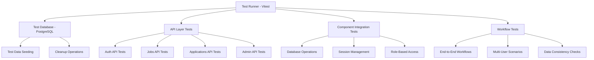

# Design Document

## Overview

This document outlines the design for comprehensive real integration tests for the PlacementConnect system. The tests will validate end-to-end functionality by testing actual API endpoints, database operations, and component interactions without mocking. The testing framework will use Vitest with a real PostgreSQL test database to ensure authentic system behavior validation.

The integration tests will cover all major functional requirements including user registration/authentication, job posting lifecycle, application workflows, administrative operations, and cross-component data consistency. Each test suite will simulate real user interactions and validate system responses across the entire technology stack.

## Architecture

### Test Environment Architecture



### Test Database Strategy

- **Dedicated Test Database**: Use a separate PostgreSQL database for testing to avoid conflicts with development data
- **Database Seeding**: Create consistent test data before each test suite
- **Transaction Rollback**: Use database transactions that can be rolled back after each test
- **Schema Validation**: Ensure test database schema matches production schema

### Test Organization Structure

```
tests/real_integration/
├── setup/
│   ├── database.js          # Database setup and teardown
│   ├── test-data.js         # Test data seeding utilities
│   └── auth-helpers.js      # Authentication helper functions
├── auth/
│   ├── registration.test.js # User registration workflows
│   ├── login.test.js        # Authentication workflows
│   └── role-access.test.js  # Role-based access control
├── jobs/
│   ├── job-lifecycle.test.js    # Job posting CRUD operations
│   ├── job-approval.test.js     # Job approval workflows
│   └── job-search.test.js       # Job search and filtering
├── applications/
│   ├── application-flow.test.js # Application submission and tracking
│   ├── status-updates.test.js   # Application status management
│   └── duplicate-prevention.test.js # Duplicate application handling
├── admin/
│   ├── user-management.test.js  # User approval/rejection
│   ├── dashboard-data.test.js   # Dashboard statistics
│   └── reporting.test.js        # Report generation
├── workflows/
│   ├── end-to-end.test.js       # Complete placement workflows
│   ├── concurrent-users.test.js # Multi-user scenarios
│   └── data-consistency.test.js # Cross-component consistency
└── utils/
    ├── api-client.js        # HTTP client for API calls
    ├── test-users.js        # Test user creation utilities
    └── assertions.js        # Custom assertion helpers
```

## Components and Interfaces

### Test Database Manager

**Purpose**: Manages test database lifecycle, seeding, and cleanup operations.

**Key Methods**:
- `setupTestDatabase()`: Initialize test database with schema
- `seedTestData()`: Create consistent test data for each test suite
- `cleanupDatabase()`: Remove test data after tests complete
- `createTransaction()`: Start database transaction for test isolation
- `rollbackTransaction()`: Rollback changes after test completion

**Database Seeding Strategy**:
- Create test users for each role (Student, Recruiter, TPO)
- Generate sample job postings in various approval states
- Create sample applications with different statuses
- Ensure referential integrity across all test data

### API Test Client

**Purpose**: Provides a consistent interface for making HTTP requests to API endpoints with authentication handling.

**Key Methods**:
- `authenticateUser(credentials)`: Login and store session cookies
- `makeRequest(method, endpoint, data)`: Make authenticated API requests
- `registerUser(userData)`: Register new users with role-specific data
- `createJobPosting(jobData)`: Create job postings as recruiter
- `submitApplication(applicationData)`: Submit job applications as student

**Authentication Handling**:
- Store session cookies from login responses
- Include cookies in subsequent requests
- Handle session expiration and re-authentication
- Support role switching for multi-user scenarios

### Test Data Factory

**Purpose**: Creates consistent, realistic test data for various scenarios.

**Key Methods**:
- `createStudentData()`: Generate student registration data with academic records
- `createRecruiterData()`: Generate recruiter data with company information
- `createJobPostingData()`: Generate job posting data with eligibility criteria
- `createApplicationData()`: Generate application data linking students and jobs

**Data Consistency**:
- Ensure email uniqueness across all user types
- Generate realistic academic records for students
- Create valid company profiles for recruiters
- Maintain referential integrity in relational data

### Workflow Test Orchestrator

**Purpose**: Coordinates complex multi-step workflows involving multiple user roles.

**Key Methods**:
- `executeRegistrationWorkflow()`: Complete user registration and approval process
- `executeJobPostingWorkflow()`: Create, approve, and publish job postings
- `executeApplicationWorkflow()`: Submit and track job applications
- `executePlacementWorkflow()`: Complete end-to-end placement process

**Workflow Coordination**:
- Manage state transitions across multiple API calls
- Validate intermediate states during workflow execution
- Handle error scenarios and recovery mechanisms
- Ensure proper cleanup after workflow completion

## Data Models

### Test User Profiles

```javascript
// Student Test Profile
const testStudent = {
  name: "Test Student",
  email: "student.test@example.com",
  password: "TestPassword123!",
  role: "STUDENT",
  enrollmentNo: "TEST001",
  facultyNo: "FAC001",
  academicRecords: {
    classXPercentage: 85.5,
    classXIIPercentage: 88.2,
    courseEnrolled: "Computer Science",
    college: "Test College",
    currentCGPA: 8.5,
    currentYearSemester: "Final Year",
    resumeLink: "https://example.com/resume.pdf"
  }
};

// Recruiter Test Profile
const testRecruiter = {
  name: "Test Recruiter",
  email: "recruiter.test@example.com",
  password: "TestPassword123!",
  role: "RECRUITER",
  companyName: "Test Company Inc.",
  companyProfile: "Leading technology company specializing in software development"
};

// TPO Admin Test Profile
const testTPO = {
  name: "Test TPO Admin",
  email: "tpo.test@example.com",
  password: "TestPassword123!",
  role: "TPO"
};
```

### Test Job Posting Data

```javascript
const testJobPosting = {
  jobDescription: "Software Developer position for fresh graduates with strong programming skills in JavaScript and React",
  eligibilityCriteria: "Minimum 70% in Class X and XII, CGPA above 7.0, Computer Science background preferred",
  applicationDeadline: new Date(Date.now() + 30 * 24 * 60 * 60 * 1000) // 30 days from now
};
```

### Test Application Data

```javascript
const testApplication = {
  jobId: "job_id_from_test_job",
  studentId: "student_id_from_test_student",
  applicationStatus: "APPLIED"
};
```

## Error Handling

### Test Failure Scenarios

**Database Connection Failures**:
- Implement retry mechanisms for database connections
- Provide clear error messages when database is unavailable
- Skip tests gracefully when database setup fails

**API Endpoint Failures**:
- Validate API responses for expected status codes
- Handle network timeouts and connection errors
- Provide detailed error context for debugging

**Data Consistency Issues**:
- Implement data validation checks before and after operations
- Detect and report data corruption scenarios
- Provide rollback mechanisms for failed operations

### Test Environment Validation

**Pre-Test Validation**:
- Verify database connectivity and schema
- Validate environment variables and configuration
- Check API endpoint availability

**Post-Test Cleanup**:
- Ensure complete data cleanup after test completion
- Validate database state after cleanup operations
- Report any cleanup failures for investigation

## Testing Strategy

### Test Isolation Strategy

**Database Transactions**:
- Wrap each test in a database transaction
- Rollback transaction after test completion
- Ensure no test data persists between tests

**Session Management**:
- Clear all session cookies between tests
- Reset authentication state for each test
- Prevent session leakage between test scenarios

### Test Data Management

**Seeding Strategy**:
- Create fresh test data for each test suite
- Use deterministic data generation for reproducible tests
- Maintain referential integrity across all test data

**Cleanup Strategy**:
- Remove all test data after test completion
- Validate complete cleanup before next test execution
- Handle cleanup failures gracefully

### Performance Considerations

**Test Execution Speed**:
- Use database transactions for fast rollback
- Minimize API calls through efficient test design
- Parallel test execution where possible

**Resource Management**:
- Limit concurrent database connections
- Implement connection pooling for test database
- Monitor memory usage during test execution

### Continuous Integration Integration

**CI/CD Pipeline Integration**:
- Provide test database setup scripts for CI environments
- Generate test reports in standard formats
- Integrate with existing CI/CD workflows

**Test Result Reporting**:
- Generate detailed test reports with coverage metrics
- Provide failure analysis and debugging information
- Track test performance and reliability metrics

## Test Execution Flow

### Setup Phase
1. Initialize test database with clean schema
2. Seed consistent test data for all scenarios
3. Configure API client with base URL and settings
4. Validate test environment readiness

### Execution Phase
1. Run authentication and authorization tests
2. Execute job posting lifecycle tests
3. Validate application workflow tests
4. Test administrative dashboard functionality
5. Run end-to-end workflow scenarios
6. Validate data consistency across components

### Teardown Phase
1. Clean up all test data from database
2. Close database connections
3. Generate test reports and metrics
4. Validate complete cleanup success